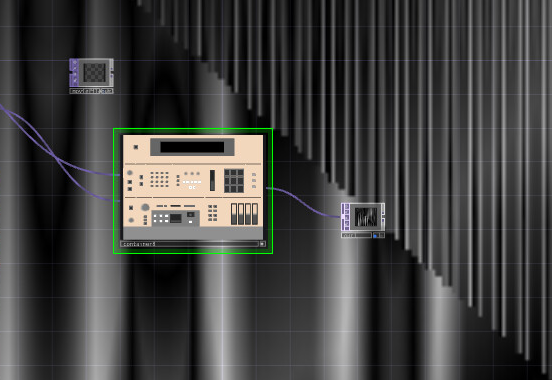
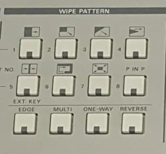

# VJ-DX 30
## A TouchDesigner implementation of the classic Panasonic WJ-MX 30 mixer. Project will ideally replicate every function of the original hardware

### VJ-DX 30 contains two channels with multiple means of keying and feeding back imagery. The ramps fed to the crossfader are as follows

https://github.com/ncavazos/VJ-DX-30/blob/main/vj_dx_30.tox <---- file to put in your TouchDesigner pallette
